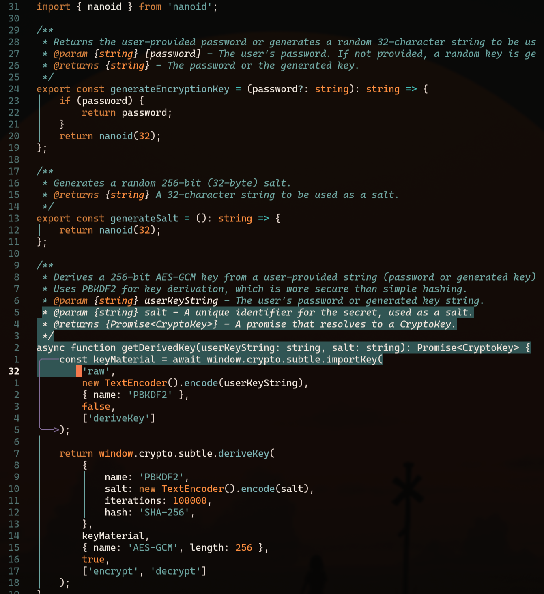

# Firesky

Firesky is a simple, elegant, and dark theme for Neovim inspired by the dramatic contrast of a silhouetted landscape against a fire-lit sky. It's designed for those moments of deep focus, when the world fades away and all that's left is you and your code.

<p align="center">
  
</p>

> In twilight's embrace, where embers glow,  
> Against the void, the warm lights flow.  
> Each line of code, a spark of thought,  
> In firesky's realm, where dreams are wrought,  
> And peaceful focus comes to grow.  

## Screenshot

<p align="center">
  
</p>

## Installation

Install with your favorite plugin manager.

### lazy.nvim

Add the following to your `lazy.nvim` configuration:

```lua
{
  "bjarneo/firesky.nvim",
  priority = 1000,
  opts = {
    disable = {
      background = true, -- Transparent background
    },
  },
  config = function(_, opts)
    require('firesky').setup(opts)
    vim.cmd.colorscheme "firesky"
  end,
}
```

## Usage

### Basic Usage
To use the theme with default settings, add the following to your `init.lua`:

```lua
require('firesky').setup()
vim.cmd.colorscheme "firesky"
```

### Advanced Configuration
Customize the theme with options:

```lua
require('firesky').setup({
  -- Disable specific features
  disable = {
    background = false,      -- Set to true for transparent background
    terminal_colors = false, -- Set to true to disable terminal colors
    italic_comments = false, -- Set to true to disable italic comments
  },

  -- Override specific colors
  colors = {
    -- Example: make comments more visible
    comment = "#6a8d8b",
    -- Example: change function color
    func = "#8ca6a9",
  },

  -- Override specific highlights
  highlights = {
    -- Example: custom TODO highlight
    Todo = { fg = "#ffb284", bg = "#4d6161", bold = true },
  },

  -- Configure plugin integrations
  plugins = {
    treesitter = true,
    lsp = true,
    telescope = true,
    nvimtree = true,
    whichkey = true,
    gitsigns = true,
    indent_blankline = true,
    markdown = true,
  },
})
vim.cmd.colorscheme "firesky"
```

### X.com
https://x.com/iamdothash
